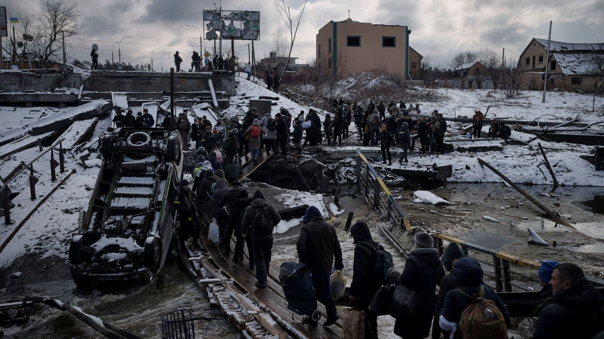

```{r setup, include=FALSE}
knitr::opts_chunk$set(echo = TRUE)
```

# Introduction
Ever since the war between Russia and Ukraine has been declear, it became one of the topics that each indicidual should know. For data scientists, the war provides us the opportunities to collect the data of a modern war, to see what elements are more important, and what elements are less important in a modern war. We also want to know what impact the war will caluse on economic, currency, and social structural. Our project will explore those.




